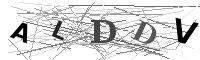
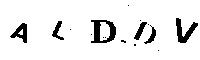

# Break Vulnerable CAPTCHA

With this project I would bypass the CAPTCHA generated [here](https://forms.iit.it/captcha.php)


This is an example of CAPTCHA:



First, the program cleans the image, obtaining something like:



After that, the program will split each letter and input them to a Neural Network that will try to guess the result.

The average accuracy reached per letter is ~97%, corresponding to an ~85% per CAPTCHA

## Requirements
- Python 3.x
- An environments with installed the libraries in ```requirements.txt``` (you can run ```conda env create -f environment.yml```)